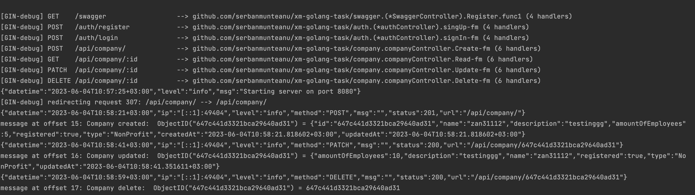

# Description

The project is based on a domain-driven approach, each module containing models, DTOs, repositories, controllers, and services. The framework can be changed very easily by implementing the IServer interface for a smooth transition from HTTP to GRPC, for example. The same thing is done with the database side, where you can easily switch from MongoDB to PostgreSQL.

I didn't use UUIDs for the company model because with MongoDB it would have made insertion difficult in case of an extraordinarily large batch. I didn't understand whether mutation processing was wanted on Kafka synchronously or asynchronously; it didn't make sense to do it asynchronously on Kafka so it's done synchronously in the HTTP call, and a message with an event is written to the topic and read asynchronously by the application when something new appears in the topic.

# Project Checklist

- [x] On each mutating operation, an event should be produced
- [x] Dockerize the application to be ready for building the production docker image
- [x] Use docker for setting up the external services such as the database
- [x] REST is suggested, but GRPC is also an option
- [x] JWT for authentication
- [x] Kafka for events
- [x] DB is up to you
- [ ] Integration tests are highly appreciated
- [x] Linter
- [x] Configuration file

# Added also

- [x] Makefile for shortcuts
- [x] JWT with public/private keys
- [x] Swagger url, but the json is empty because I didn't have the time to write it

# Outputs

